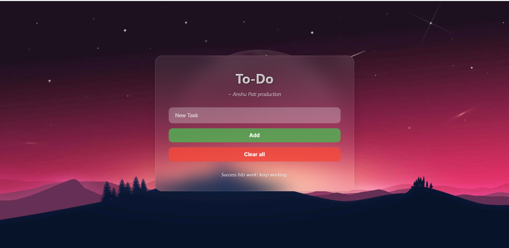

# To-Do Web Application

A beautiful and responsive to-do list web application with CRUD operations and local storage functionality. Features an aesthetic backdrop with a sleek, blurry interface design.

Website - https://anshutodo.vercel.app



## ✨ Features

- **Full CRUD Operations**: Create, Read, Update, and Delete tasks
- **Responsive Design**: Works seamlessly across all device sizes
- **Local Storage**: All tasks are saved locally in your browser
- **User-Friendly**: Clean, intuitive interface with smooth interactions
- **Real-time Updates**: Tasks update instantly without page refresh

## 🛠️ Technology Stack

- **HTML5**: Structure and semantic markup
- **CSS3**: Styling, animations, and responsive design
- **JavaScript**: CRUD functionality and local storage management
- **LocalStorage**: Data persistence without backend

## 🚀 Getting Started

### Prerequisites
- A modern web browser
- Basic understanding of HTML, CSS, and JavaScript (for development)

### Installation

1. **Fork the Repository**
   - Click the "Fork" button on the repository page

2. **Clone Your Fork**
   ```bash
   git clone https://github.com/anshu2k24/to-do.git
   cd to-do
   ```

3. **Open the Application**
   - Simply open `index.html` in your web browser

## 📁 Project Structure

```
todo-webapp/
├── index.html          # Main HTML file
├── styles.css          # CSS styles and responsive design
├── script.js           # JavaScript functionality
├── background.jpg      # Primary background image
└── README.md           # Project documentation
```

## 🔧 How It Works

1. **Add Tasks**: Type in the input field and click "Add" to create new tasks
2. **Edit Tasks**: Click the "edit" button on any task to modify it and click on "update"
3. **Delete Tasks**: Use the "delete" button to remove individual tasks
4. **Clear All**: Remove all tasks at once with the "Clear all" button
5. **Data Persistence**: All tasks are automatically saved to local storage

## 🤝 Contributing

Feel free to fork this project and make improvements! This is a learning project, so contributions and suggestions are welcome.

## 📄 License

This project is open source and available under the [MIT License](LICENSE).

## 🙏 Acknowledgments

- Background images and design inspiration from various sources
- Credits: Beautiful background image [ https://wallpapers.com/4k-desktop-background ]
- Created as a learning exercise to apply fundamental web development concepts

---

**Note**: This is a frontend-only application that uses local storage. Data will persist in your browser but won't sync across different devices or browsers.
